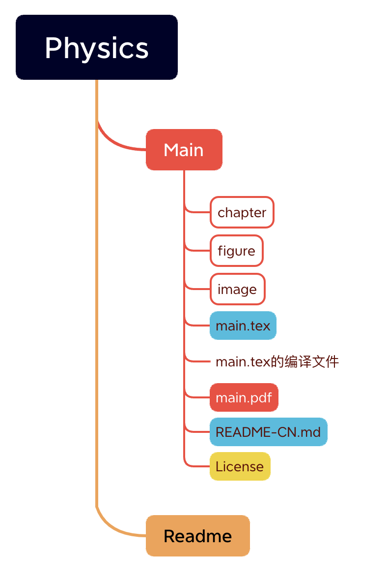

# Physics
泰山学堂物理取向生存指南

# 基本介绍

你好，这是《泰山学堂物理取向生存指南》，我们创建这个项目的初衷是给每一位来到泰山学堂物理取向的学生提供一些必要的帮助，以减少一些弯路。

# 如何加入我们为这个文档作出贡献？

* 首先，这是一个简单的 $\LaTeX$ 文档，并且基于Overleaf上一个模板进行写作，因此您需要具备基本的 $\LaTeX$ 写作能力。
* 这是一个基于 GitHub 的一个项目，因此也需要您具备一定的Git 和GitHub使用技能

## 获取项目文件
复制这个项目的GitHub 链接，在自己的终端选择一个合适的文件目录下输入

```
git clone git@github.com:Funyday-k/Physics.git
```

然后您就可以下载到该项目的源文件了

## 该项目基本构成

由于是在原模板的基础上进行更改的文档，所以我大致介绍一下这个tex文件的组成，如图



​
分别介绍

* Main:主文件夹
* chapter：我们编写内容的时候，将每个章节的内容放在单独一个tex文件里，以实现模块化
* image：**章节** 内容中出现的图片存放在这里，命名规则：章节名称_图片名称.jpg
* figure: 主要tex以及README文件中出现的图片存放于此，命名规则：图片名称.jpg
* main.tex: tex的主干文件，章节内容将用 include{chapter.tex} 的形式进行编译

我们尽量规范的编辑该文档，方便你我他。